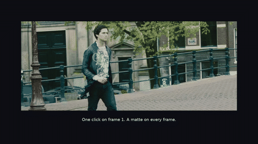
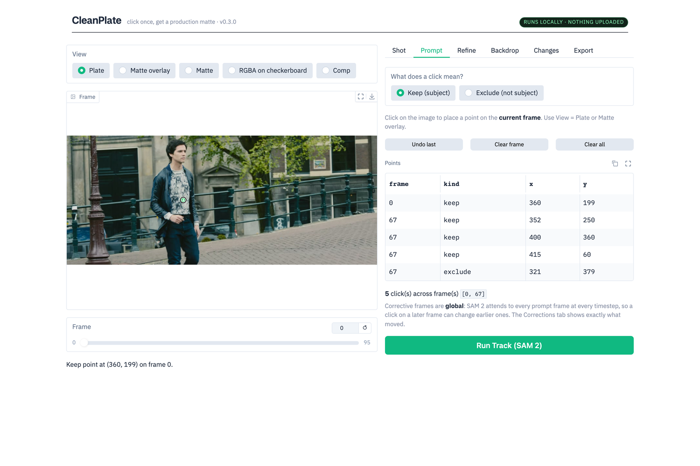
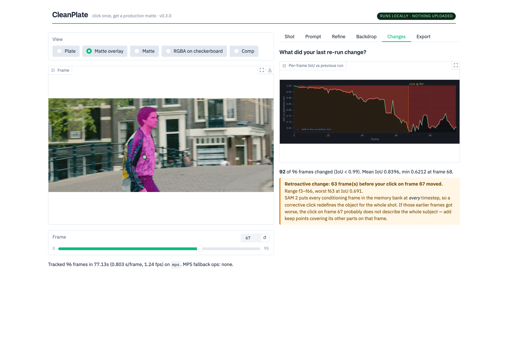

# CleanPlate

**Click a person once. Get a production matte on every frame. Click a thing, and it's
gone, with the background filled in behind it. All of it runs on your own machine.**

[](https://colab.research.google.com/github/shauryadata/cleanplate/blob/main/notebooks/cleanplate_colab.ipynb)
&nbsp; MIT core · Apple Silicon, CUDA or CPU · no cloud, no keys, no per-frame billing



Rotoscoping is the tax on every visual effect: someone traces a person out of a plate,
frame by frame. CleanPlate does it from a click, with a soft edge that holds up on hair,
and tells you when a correction quietly changed frames you already approved.

- **Matte** — SAM 2 tracks the subject from one or two clicks; MatAnyone 2 turns the hard
  mask into a soft alpha. About a second a frame at 960 px on an M3 Pro.
- **Remove** — dilate the matte into a hole and let ProPainter fill it from the
  surrounding frames. A lamppost, tracking markers, one actor of two.
- **Measure** — [RotoBench](docs/ROTOBENCH.md) scores mattes against the *Tears of Steel*
  compositing team's own keys, on twelve clips whose truth is proven frame-aligned.

## Why a benchmark, and why this one

Every matting tool claims a clean edge. Without a reference you can only measure whether
a matte is *stable*, and stability is not correctness:

| Method | consecutive-frame IoU | error vs the key |
|---|---|---|
| MatAnyone 2 | 0.9707 | 156 |
| hairzoom2 — best matte in the set | 0.9679 | **151** |
| binary (SAM 2 alone) | 0.9665 | 202 |
| **a frozen matte: frame 1, repeated** | **1.0000** | **435** |

A matte that never moves is perfectly self-consistent and completely wrong. The best
matte here ranks sixth of seven on stability. Spearman between the two rankings: **−0.25**.

That is why RotoBench exists, and it is why this project re-tested its own past claims
against professional truth: of thirteen conclusions, **eight held, three reversed, one was
partial**. The reversals are in [ROTOBENCH_RESULTS.md](docs/ROTOBENCH_RESULTS.md),
including the one that mattered — the chroma keyer this project used as its reference for
two tasks turned out not to rank methods reliably (ρ = 0.75).

## Try it

**In the browser, no install:** the [Colab notebook](https://colab.research.google.com/github/shauryadata/cleanplate/blob/main/notebooks/cleanplate_colab.ipynb)
fetches the models, mattes a demo shot from two clicks, composites it onto Mars, and then
takes a clip of your own. One manual step: switch the runtime to a T4 GPU.

**Locally:**

```bash
git clone https://github.com/shauryadata/cleanplate.git && cd cleanplate
python3 -m venv .venv && source .venv/bin/activate
pip install -r requirements.txt
./scripts/download.sh          # footage + SAM 2 + weights (nothing large is committed)
python app.py                  # -> http://127.0.0.1:7860
```

That is the whole install; **Load demo shot (walk)** in the app cuts the demo shot for
you. Verified from a cold clone on a clean machine — transcript in
[TASK3_REPORT.md](docs/TASK3_REPORT.md).

## The app



Click the subject on any frame. Green keeps, red excludes, every point listed per frame.
**Run Track** propagates it through the shot with live progress.



The **Changes** tab is the part that does not exist elsewhere. After a re-run it diffs
against the previous run frame by frame and flags frames that changed *before* the one you
corrected. SAM 2 attends to every conditioning frame at every timestep, so a corrective
click silently redefines the object for the whole shot. This is what that looks like when
it goes wrong, and the app says so instead of leaving you to find it.

## Removing things


Same matte, dilated into a hole, filled by [ProPainter](https://github.com/sczhou/ProPainter).
About 2.2 s/frame at 960 px — roughly ten times matting, and the stage most likely to run a
machine out of memory, so every heavy stage runs under a guard that kills the job rather
than let the machine swap itself to death.

**A camera move is removal's friend.** Panning past an object is parallax, and parallax
reveals what is actually behind it. An object that holds still relative to camera never
reveals its background, so the fill is invention — that is the smudge you will see behind
a static subject. Numbers, three worked examples and the full failure list:
[REMOVAL_BENCH.md](docs/REMOVAL_BENCH.md).

## Local by design

CleanPlate never sends your footage anywhere. That is a product decision, not an
oversight, and it is enforced rather than promised:

- **No uploads.** Frames, mattes and comps are read and written on your disk. The
  browser talks to a server on your own machine.
- **No share link.** `share=False`; Gradio's public tunnel is never created.
- **Loopback only.** The server binds `127.0.0.1` by default.
- **No telemetry.** `analytics_enabled=False`, plus `GRADIO_ANALYTICS_ENABLED=False` and
  `HF_HUB_DISABLE_TELEMETRY=1` set before Gradio and the Hugging Face client load.
- **No "share to Spaces" button.** Gradio's image component ships one by default; it posts
  to Hugging Face Spaces Discussions, so CleanPlate removes it.
- **No accounts, no keys, no per-frame billing.** The only network access is the one-time
  `scripts/download.sh`.

Checked, not assumed. With the app running and a page loaded, **every one of the 60
requests the browser made went to `127.0.0.1`** — scripts, styles and web fonts included.
`lsof` shows a single loopback listener and no outbound sockets.

## Pipeline

```
movie ─► extract_shot ─► pick_point ─► track_matte ─► refine_matte ─► export_rgba ─► comp_preview
          (jpg frames)     (clicks)    (SAM 2 video,  (MatAnyone 2,   (RGBA +        (comp.mp4,
                                        binary mask)   soft alpha)     despill)       harmonize)
                                                 └──────────► metrics ◄──────────┘
```

| | |
|---|---|
| Device | Apple M3 Pro, 18 GB, MPS — **zero fallback ops in any model stage** |
| Track (SAM 2.1 hiera-small) | ~0.82 s/frame |
| Refine (MatAnyone 2, default) | ~0.22 s/frame |
| Refine + hair zoom (HQ toggle) | ~0.49 s/frame — best matte on professional truth |
| Remove (ProPainter, fp16) | ~2.2 s/frame |

<details>
<summary>Or drive the same pipeline from the CLI</summary>

```bash
# cut a shot out of the movie
python src/extract_shot.py --name walk --start 270 --duration 4

# click the actor once (writes shots/walk/point.json)
python src/pick_point.py --shot walk

# propagate the matte through every frame; --at adds a corrective click on any frame
python src/track_matte.py --shot walk --point 360,200 \
    --at 67:352,250:+ --at 67:400,360:+ --at 67:415,60:+ --at 67:321,379:- \
    --out-name walk_v2

# turn the binary mask into a soft alpha  (optional stage, see the licence note below)
python src/refine_matte.py --shot walk --masks outputs/walk_v2/masks --out-name walk_v2

# merge frames + soft alpha into RGBA, suppressing green edge spill
python src/export_rgba.py --shot walk --out-name walk_v2 \
    --alpha outputs/walk_v2/alpha --despill green

# comp over a new background: colour-matched, and optionally with the plate's own
# camera move tracked onto the background
python src/comp_preview.py --shot walk --out-name walk_v2 \
    --bg-image datasets/backgrounds/mars_curiosity_360_pano.jpg \
    --bg-crop 545,117,1902,424 --track-bg

# put numbers on it
python src/metrics.py --run "v1=outputs/walk/masks" --run "v2=outputs/walk_v2/alpha"
```
</details>

> **Licence note.** The refine stage uses **MatAnyone** (S-Lab License 1.0, **non-commercial
> only**) and removal uses **ProPainter** (same licence). Neither is bundled:
> `scripts/download.sh` clones them into gitignored `vendor/`, pinned to the commits every
> published number was produced with. CleanPlate runs without them, producing the binary
> SAM 2 matte. The MIT core never bundles non-commercial code. See
> [THIRD_PARTY.md](THIRD_PARTY.md).

## What is still wrong

Kept in the open, with measurements, in [KNOWN_ISSUES.md](docs/KNOWN_ISSUES.md):

- **Coverage, not edges, is the real failure.** 85.8% of the pixels our mattes miss are
  regions the segmentation never selected at all. Two repair methods were built, scored
  against a rule fixed in advance, and **both failed** — they recover 0.4% and 1.9%. The
  lever is prompting: on one clip, a single extra click moved whole-frame error from 129.8
  to 4.8.
- **The hair-zoom pass does not fit on wide subjects** on 18 GB; the app refuses it above
  1.2 MP and says why.
- **Harmonize is v0**: one global colour and exposure match per shot. Nothing directional,
  no contact shadow, no light wrap.

## Docs

| | |
|---|---|
| [ROTOBENCH.md](docs/ROTOBENCH.md) | the benchmark: truth, provenance, standings, how to submit a method |
| [ROTOBENCH_RESULTS.md](docs/ROTOBENCH_RESULTS.md) | standings, the claims ledger, per-clip numbers |
| [REMOVAL_BENCH.md](docs/REMOVAL_BENCH.md) | removal accuracy, cost and failure catalogue |
| [DECISIONS.md](docs/DECISIONS.md) | why each model and default was chosen |
| [KNOWN_ISSUES.md](docs/KNOWN_ISSUES.md) | measured, reproducible, unfixed |
| [SUBJECT_CONVENTION.md](docs/SUBJECT_CONVENTION.md) | what "the subject" means when a key and a click disagree |

Build reports, oldest to newest: [1](docs/TASK1_REPORT.md) one-click matte ·
[2](docs/TASK2_REPORT.md) soft alpha · [3](docs/TASK3_REPORT.md) the app ·
[4](docs/TASK4_REPORT.md) ground truth · [5](docs/TASK5_REPORT.md) removal ·
[6](docs/TASK6_REPORT.md) professional truth · [7](docs/TASK7_REPORT.md) the launch build.

## Layout

| Path | What lives there |
|---|---|
| `cleanplate/` | The package: track, refine, compose, remove, harmonize, metrics |
| `app.py`, `src/` | The local web app, and the CLI pipeline scripts |
| `scripts/` | `download.sh` and every reproducible build step (benchmark, reel, figures) |
| `docs/` | Benchmark, decisions, reports, the reel's shot list |
| `truth/`, `vendor/`, `shots/`, `outputs/`, `checkpoints/` | Gitignored; re-fetched or rebuilt |

Footage, model weights, the venv and all outputs are gitignored by design.
`scripts/download.sh` re-fetches every one of them, and the benchmark clips rebuild
bit-identically.

## License

MIT — see [LICENSE](LICENSE). Footage: **(CC) Blender Foundation | mango.blender.org**
(CC BY 3.0). Third-party components, model licences and reel assets are listed in
[THIRD_PARTY.md](THIRD_PARTY.md).
