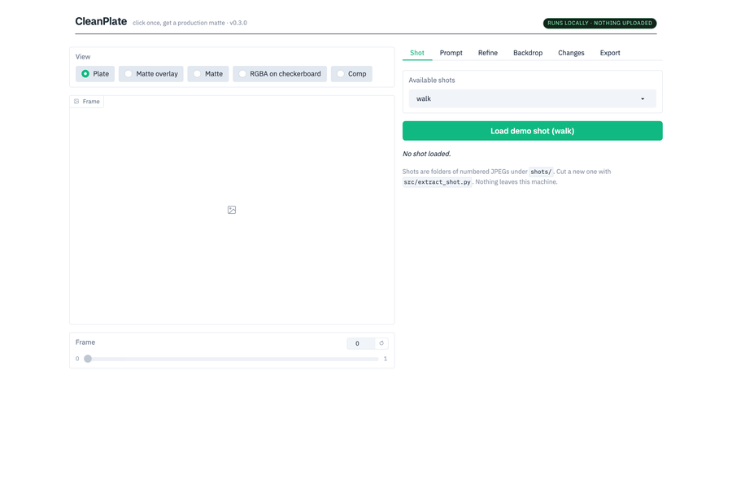

# CleanPlate

Open-source, fully local AI rotoscoping and cleanup for film. Click once, get a production matte.

No cloud, no API keys, no per-frame billing. Everything runs on your own machine —
Apple Silicon (MPS), CUDA, or CPU.

## Status

**Task 3 — the app: done.** The CLI pipeline is now a local web app. One command, load
a clip, click the subject, get a matte, correct it, export.

```bash
python app.py
```



| | |
|---|---|
| Device | Apple M3 Pro, MPS — **zero fallback ops in either model stage** |
| Track (SAM 2.1 hiera-small) | ~0.82 s/frame (1.2 fps) |
| Refine (MatAnyone) | ~0.13 s/frame (7.9 fps) |
| RGBA + despill | ~0.007 s/frame |
| Whole 96-frame shot, in the app | about 95 s |

Earlier tasks: [Task 1](docs/TASK1_REPORT.md) (one-click matte),
[Task 2](docs/TASK2_REPORT.md) (soft alpha, metrics), [Task 3](docs/TASK3_REPORT.md)
(this app). Decisions in [DECISIONS.md](docs/DECISIONS.md), numbers in
[METRICS.md](docs/METRICS.md).

RotoBench — a public benchmark of AI matte quality — comes in a later phase.

## Local by design

CleanPlate never sends your footage anywhere. That is a product decision, not an
oversight, and it is enforced rather than promised:

- **No uploads.** Frames, mattes and comps are read and written on your disk. The
  browser talks to a server on your own machine.
- **No share link.** `share=False`; Gradio's public tunnel is never created.
- **Loopback only.** The server binds `127.0.0.1` by default, so it is not reachable
  from your network.
- **No telemetry.** `analytics_enabled=False` on the app, plus
  `GRADIO_ANALYTICS_ENABLED=False` and `HF_HUB_DISABLE_TELEMETRY=1` set before Gradio
  and the Hugging Face client load.
- **No "share to Spaces" button.** Gradio's image component ships one by default; it
  posts to Hugging Face Spaces Discussions, so CleanPlate removes it.
- **No accounts, no keys, no per-frame billing.** The only network access is the
  one-time `scripts/download.sh`, which fetches the footage, SAM 2 and the model
  weights.

## Pipeline

```
movie ─► extract_shot ─► pick_point ─► track_matte ─► refine_matte ─► export_rgba ─► comp_preview
          (jpg frames)     (clicks)    (SAM 2 video,  (MatAnyone,     (RGBA +        (comp.mp4,
                                        binary mask)   soft alpha)     despill)       side_by_side,
                                                                                      v1_vs_v2)
                                                 └──────────► metrics ◄──────────┘
```

`contact_sheet.py` sits alongside these: scout a whole movie for shots, or review any
folder of numbered frames (source, masks, overlays, comps).

## The app


Click the subject on any frame. Green keeps, red excludes, and every point is listed
per frame. Run Track propagates it through the shot with live progress.


The **Changes** tab is the part that does not exist elsewhere. After a re-run it diffs
against the previous run frame by frame and, crucially, flags frames that changed
*before* the frame you corrected. SAM 2 attends to every conditioning frame at every
timestep, so a corrective click silently redefines the object for the whole shot — this
is what that looks like when it goes wrong, and the app says so instead of leaving you
to find it.

## Quickstart

```bash
git clone https://github.com/shauryadata/cleanplate.git && cd cleanplate
python3 -m venv .venv && source .venv/bin/activate
pip install -r requirements.txt
./scripts/download.sh          # footage + SAM 2 + weights (nothing large is committed)
python app.py                  # -> http://127.0.0.1:7860
```

That is the whole install. The app's **Load demo shot (walk)** button cuts the demo
shot out of the source movie for you, so you never have to touch the CLI.

Verified from a cold clone on a clean machine — the exact transcript is in
[docs/TASK3_REPORT.md](docs/TASK3_REPORT.md).

<details>
<summary>Or drive the same pipeline from the CLI</summary>

```bash

# cut a shot out of the movie
python src/extract_shot.py --name walk --start 270 --duration 4

# click the actor once (writes shots/walk/point.json)
python src/pick_point.py --shot walk

# propagate the matte through every frame; --at adds a corrective click on any frame
python src/track_matte.py --shot walk --point 360,200 \
    --at 67:352,250:+ --at 67:400,360:+ --at 67:415,60:+ --at 67:321,379:- \
    --out-name walk_v2

# turn the binary mask into a soft alpha  (optional stage, see the licence note below)
python src/refine_matte.py --shot walk --masks outputs/walk_v2/masks --out-name walk_v2

# merge frames + soft alpha into RGBA, suppressing green edge spill
python src/export_rgba.py --shot walk --out-name walk_v2 \
    --alpha outputs/walk_v2/alpha --despill green

# comp over a new background, and render a 2x2 against the previous run
python src/comp_preview.py --shot walk --out-name walk_v2 \
    --bg-crop 380,125,1680,600 --compare-with walk

# put numbers on it
python src/metrics.py --run "v1=outputs/walk/masks" --run "v2=outputs/walk_v2/alpha"
```
</details>

> **Licence note.** The refine stage uses **MatAnyone**, which is **S-Lab License 1.0 —
> non-commercial use only**. It is never bundled: `scripts/download.sh matanyone` clones it
> into gitignored `vendor/`, and CleanPlate runs fine without it, producing the binary
> SAM 2 matte. See [THIRD_PARTY.md](THIRD_PARTY.md).

`PYTORCH_ENABLE_MPS_FALLBACK=1` is set by `track_matte.py` itself, so unimplemented MPS
ops degrade to CPU instead of crashing. Pass `--device cpu` to take MPS out of the picture
entirely.

## Layout

| Path | What lives there |
|---|---|
| `src/` | The pipeline scripts |
| `docs/` | Task reports, decisions, metrics |
| `vendor/` | SAM 2 and MatAnyone checkouts (gitignored, re-fetched) |
| `shots/` | Source movie and extracted JPEG frame folders (gitignored) |
| `outputs/` | Masks, RGBA sequences, comps (gitignored) |
| `scripts/` | `download.sh` — re-fetches footage, SAM 2, and weights |
| `checkpoints/` | SAM 2 weights (gitignored) |

Footage, model weights, the venv, and all outputs are gitignored by design.
`scripts/download.sh` re-fetches every one of them.

## License

MIT — see [LICENSE](LICENSE). Third-party components and footage credits are listed in
[THIRD_PARTY.md](THIRD_PARTY.md).
