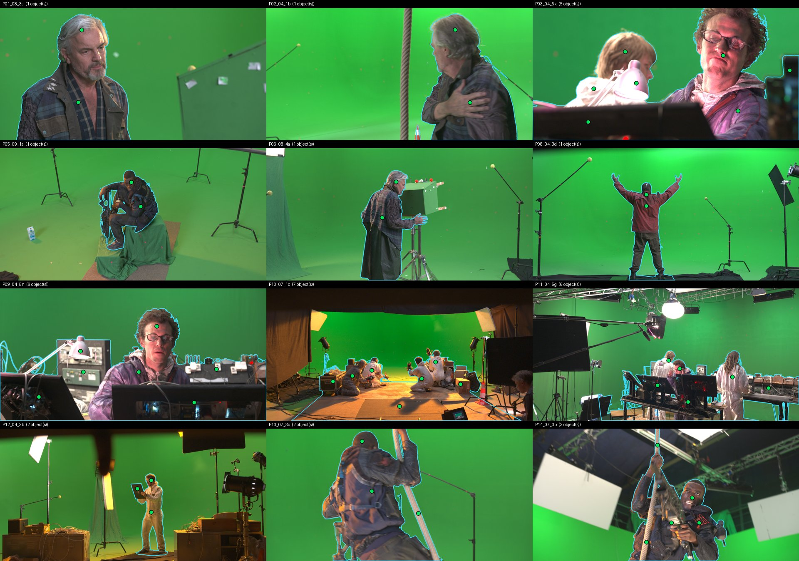

# RotoBench v1

**A benchmark for AI rotoscoping on real film plates, scored against the compositors' own
keys.**

RotoBench asks one question about a matting method: given a subject, how close does its
alpha matte come to the one a professional compositing team actually shipped? The
footage is real production plates from *Tears of Steel* (Blender Foundation, CC BY 3.0).
The reference is the Mango team's own key for each plate, published alongside the
plates, and each clip's key is proven to be frame-aligned with its plate before any
score is computed. Twelve clips, seven methods, one command to reproduce.

It was built for [CleanPlate](../README.md), a local, open-source roto and cleanup tool,
but nothing in it is specific to CleanPlate. Any method that turns frames plus a click
prompt into an alpha sequence can be scored.

<!-- RESULTS:selfcheck -->
## Why self-consistency is not accuracy

Stability metrics - does the matte boil? - are what you can measure without a reference, and they are what CleanPlate itself reported until Task 4. This is the table that says why they are not enough. The frozen control is the best method's first frame repeated for the whole clip: as self-consistent as a matte can possibly be, and wrong from the second frame on.

| Method | consecutive-frame IoU | rank by self-consistency | band MAD vs the key | rank by truth |
|---|---|---|---|---|
| MatAnyone 2 | 0.9707 | 1 | 156.3 | 2 |
| trimap + ViTMatte | 0.9701 | 2 | 210.2 | 6 |
| MatAnyone v1 | 0.9691 | 3 | 207.8 | 5 |
| guided filter | 0.9691 | 4 | 236.9 | 7 |
| hairzoom (v1) | 0.9687 | 5 | 200.7 | 3 |
| hairzoom2 (MA2) | 0.9679 | 6 | 151.4 | 1 |
| binary (SAM 2 only) | 0.9665 | 7 | 202.0 | 4 |
| **frozen control** (best method, frame 0 repeated) | **1.0000** | **1** | 434.6 | last |

Spearman correlation between the two rankings: **-0.25**.
<!-- /RESULTS:selfcheck -->

## The reference: what it is, and what it is not

**Tier P, "professional reference".** `media.xiph.org/tearsofsteel/tearsofsteel-cleaned-exr/`
holds the compositing team's processed plates. For some shots that is the compositor's
key: the despilled foreground premultiplied over black, with the matte in a real fourth
channel. That fourth channel is RotoBench's truth. The input a method sees is the raw
plate from `tearsofsteel-footage-exr/`, converted to 8-bit display (clamp, gamma 2.2).
Nothing is composited. These are the frames the key was pulled from.

It is a **professional key, and still a key**. It is far better than a simple chroma
keyer and it is independent of every method scored here. But it is not hand-painted
roto or a rendered ground truth, and it inherits a keyer's limits: strand transparency
beyond what the keyer resolved, and nothing about objects that are not in front of the
screen.

**The archive is a mix, so every shot was classified from its pixels, not its folder
name.** Of 76 "cleaned" shots, 35 are character keys, 24 are *set* keys (a room with
a green window keyed out, where the "foreground" is every desk and lamp), and the rest
are rig-removed plates, empty folders, or constant alpha. Details in
[PRO_SURVEY.md](PRO_SURVEY.md).

**The key for frame N was pulled from plate N−1.** The two archives number frames
differently, and the obvious pairing is wrong by one frame. RotoBench proves each
clip's offset from pixels. Where the key is fully opaque, the premultiplied foreground
*is* the plate pixel, apart from despill and half-float rounding. Sensor noise is
independent frame to frame, so exactly one plate frame matches. Over 36 test frames the
true frame's residual is 4.3× to 477× below the runner-up (median 11×), and the best
spatial shift is (0, 0). Every clip in the set proves
at offset −1, at three test frames spread across its window. A clip whose minimum is
ambiguous, inconsistent across the window, or spatially shifted is refused, not built.


*Left: plate 237 with the professional key's 0.5 contour. Middle: plate and key at the
same frame number, ×40. Every hair and wrinkle lights up, so they are not the same
frame. Right: plate N−1, the noise floor, with only the despill rim left.*

## The twelve clips

| Clip | Shot | Frames | Group | What it tests |
|---|---|---|---|---|
<!-- RESULTS:cliptable -->
| P01_08_3a | 08_3a | 96 | core | backlit hair |
| P02_04_1b | 04_1b | 96 | core | large motion, turns away, hair from behind |
| P03_04_5k | 04_5k | 96 | core | curly hair, two subjects, keyed props (lamp, desk) |
| P05_09_1a | 09_1a | 96 | core | dark subject, held object, complex silhouette |
| P06_08_4a | 08_4a | 96 | core | full body, hands, slow control |
| P08_04_3d | 04_3d | 96 | core | full body, outstretched arms |
| P09_04_5n | 04_5n | 96 | stress | occlusion by props, curly hair |
| P10_07_1c | 07_1c | 96 | stress | two subjects, platform |
| P11_04_5g | 04_5g | 96 | stress | three subjects, tables |
| P12_04_3b | 04_3b | 69 | short | short, held object (notepad): the A4 case |
| P13_07_3c | 07_3c | 76 | short | short, fast motion, motion blur, rope |
| P14_07_3b | 07_3b | 69 | short | short, held object (rifle), rope |
<!-- /RESULTS:cliptable -->

- **Core**: six clips with 96-frame windows. The standings are built on these.
- **Stress**: three clips where the key also holds keyed set dressing (monitors, a lamp,
  a platform, tables) in front of or around the subject. Reported separately so they
  cannot swamp the core.
- **Short**: the held-object and fast-motion cases exist in the archive only as keys
  shorter than 96 frames. They run at their full keyed length (69–76 frames) and are
  reported separately.

Windows are chosen by a stated rule, not by eye: the gap-free window nearest the shot's
centre in which no significant new object enters (`scripts/select_pro.py`), re-checked
at full frame rate at build time.

**Excluded, on record** (the recipes stay in the repo with the reason):

| Shot | Why |
|---|---|
| 07_1b | The actor's held prop, a cylinder of tracking-marker balls, is held *out* of the key (presumably for a CG replacement), so the reference contradicts "held objects are the subject". |
| 07_1f | Same: the held prop is cut out of the key. |
| 04_1a | Alignment could not be proven. No plate frame matches the key (a shallow residual bowl, 30× above a real match): it was pulled from a plate not in the archive as-is. |
| 04_2c | The only defocus shot. A second actor enters at frame 104 of 111, so there is no clean window. |
| 07_1a | An extreme close-up whose key is mostly straight garbage-matte polygons. |
| 24 set keys, 13 short shots | See the survey. |

## What "the subject" is

A key says which pixels are in front of the green screen. A click says "this object".
RotoBench's convention ([SUBJECT_CONVENTION.md](SUBJECT_CONVENTION.md)): **the subject
is the key's foreground**, including held objects and second people. Specks the key also
holds that are not attached to the subject, such as a floor marker or the edge of a flag,
go in an `ignore/` mask, where every method's prediction is set equal to the reference.

Every method gets the same **oracle prompt**, derived from the reference's first frame
alone. A person gets one object with two clicks, head and body. Where one connected blob
holds several things (two people and a desk lamp), the parts are pinned by hand, one SAM
2 object each, with the reason written in the script. **The prompts were committed to git
before any method was run on these clips.**



## Metrics

All computed at the reference's resolution, 1920×1012, and validated on synthetic cases
with known answers (`tests/test_accuracy.py`).

| Metric | What it measures |
|---|---|
| MAD, MSE | mean absolute / squared alpha error (×10³) |
| Grad | gradient error after Gaussian derivatives, σ = 1.4 (Rhemann et al.) (×10³) |
| BF | boundary F-measure on the binarised matte, tolerance 0.8% of the diagonal |
| dtSSD | temporal error of the alpha's frame-to-frame change (×10²) |
| **dtSSD-n** | dtSSD divided by the reference's own motion. A matte that never moves scores exactly **1.0** on any shot, fast or slow. |
| **band** | every metric again, restricted to the reference's transition band (soft pixels plus the 0.5 contour, dilated by 0.5% of the diagonal). This is where mattes differ. |
| **coverage** | *dropouts*: pixels at least 4 px inside the reference's opaque core where the prediction is below 0.5. Edge disagreement cannot reach them. A dropout frame loses more than 0.05% of the core. |
| hair region | the older metrics restricted to the top 30% of the subject's box, kept so earlier results stay comparable |

Why dtSSD-n exists: within one shot, dtSSD and dtSSD-n rank methods identically. Across
shots they do not. A slow shot's dtSSD is small whatever a method does, so a method
that simply freezes on it loses almost nothing in a cross-shot mean. The validation
suite shows plain dtSSD ranking a method that froze *first* (0.646 against 0.805), while
dtSSD-n ranks it last and pins the frozen shot at exactly 1.0.

<!-- RESULTS:standings -->
## Standings

Core clips where every method ran (5 of 6; the zoom size cap excluded the rest - see the results page). Ranked by mean rank of band MAD across clips, so no single clip decides the order.

| Method | clips | mean rank | band MAD | band MAD median | hair MAD | MAD | BF | dtSSD-n | dropout frames | s/frame |
|---|---|---|---|---|---|---|---|---|---|---|
| hairzoom2 (MA2) | 5 | **1.20** | **151.4** | **143.7** | 15.10 | **18.23** | 0.835 | **0.681** | **50.0** | 0.49 |
| MatAnyone 2 | 5 | 2.60 | 156.3 | 152.8 | 18.05 | 18.46 | 0.834 | 0.700 | **50.0** | **0.22** |
| hairzoom (v1) | 5 | 3.60 | 200.7 | 209.4 | **14.47** | 41.19 | 0.755 | 0.758 | 58.4 | 0.50 |
| cover_960 | 5 | 4.20 | 161.9 | 165.0 | 17.72 | 18.57 | **0.836** | 0.722 | **50.0** | 0.94 |
| binary (SAM 2 only) | 5 | 5.60 | 202.0 | 228.2 | 25.23 | 37.20 | 0.756 | 1.015 | 63.0 | 0.89 |
| trimap + ViTMatte | 5 | 5.80 | 210.2 | 215.7 | 22.59 | 42.01 | 0.753 | 0.782 | 58.4 | 0.34 |
| MatAnyone v1 | 5 | 6.00 | 207.8 | 215.5 | 21.80 | 41.92 | 0.752 | 0.779 | 58.4 | 0.23 |
| cover2_960 | 5 | 7.00 | 196.4 | 246.2 | 26.28 | 23.29 | 0.784 | 0.861 | 61.0 | 0.99 |
| guided filter | 5 | 9.00 | 236.9 | 248.8 | 28.49 | 43.21 | 0.752 | 0.788 | 58.4 | 0.26 |

Per-group tables, per-clip numbers and the cost of every method: [ROTOBENCH_RESULTS.md](ROTOBENCH_RESULTS.md).
<!-- /RESULTS:standings -->

<!-- RESULTS:ledger -->
## What changed our minds

Every conclusion this project has published to itself, re-tested against the professional key. Verdict thresholds were committed before any result was read.

| # | Claim | Verdict |
|---|---|---|
| C1 | Reference hair edges are about 2 px deep (median 2.0-2.8 px on Tier A/B). | **HOLDS** |
| C2 | The baseline matte is too SOFT (4-5 px against a 2 px truth), not too hard. | **HOLDS** |
| C3 | hairzoom2 wins the hair region: MAD -37.6% vs the baseline, with the best MSE, Grad and dtSSD. | **PARTIAL** |
| C4 | Zoom with MatAnyone 2 beats zoom with v1 on 4 of 5 hair metrics, and costs less. | **REVERSES** |
| C5 | MatAnyone 2 beats v1 on every whole-frame metric at essentially the same cost - the reason it is the app default. | **HOLDS** |
| C6 | The guided filter is worse than doing nothing on hair. | **HOLDS** |
| C7 | Trimap + ViTMatte has the best hair boundary-F. | **REVERSES** |
| C8 | On real backlit hair (B1) the winner gains about half what synthetic clips suggest: -19.7% against -44%. | **HOLDS** |
| C9 | HQ (MatAnyone 2 + zoom) recovers about 12% of hair MAD on B1 against the baseline. | **HOLDS** |
| C10 | Self-consistency cannot tell you which matte is right. | **HOLDS** |
| C11 | Dropouts are a segmentation failure; the matting stage does not cause them. | **HOLDS** |
| C12 | A simple keyer is a good enough reference to rank methods (Tier B was built on that assumption). | **REVERSES** |
| C13 | Better clicks do not fix the face dropout; a corrective click made it worse. | **NOT RE-TESTED** |

The evidence for each: [ROTOBENCH_RESULTS.md](ROTOBENCH_RESULTS.md).
<!-- /RESULTS:ledger -->

## Known limitations

- **A key is not ground truth.** Tier P can reward a method for agreeing with the key's
  own errors. The best available answer, but not a perfect one.
- **Twelve clips, one film, one production.** All green-screen plates, three of them
  short. Methods within a few percent of each other are not separated by this set.
- **Occlusion is barely represented.** A key holds everything in front of the screen, so
  "the actor, minus what covers them" cannot be expressed. Keyed props stand in for it
  in the stress group.
- **The prompts are oracle prompts**, derived from the answer. RotoBench measures matte
  quality given a correct prompt, not how well a person guesses where to click.
- **The metrics inherit the working resolution** of the methods, which run at 960 px
  wide and are upscaled for scoring, as they would be in use.
- **GPU numerics move under the code.** After the macOS 27.0 update, identical code on
  identical frames shifted a few pixels (min IoU 0.99998, every metric unchanged). A
  rerun on different hardware should expect agreement to about that level, not bit for
  bit.

## Reproduce it

From a fresh clone (Apple Silicon or CUDA; about 20 GB of free disk):

```bash
./scripts/download.sh all        # models and code
./scripts/download.sh pro        # Tier P: ~15 GB of EXR fetched, 12 clips built and aligned
python scripts/run_rotobench.py  # every method on every clip, one guarded worker per job
python scripts/rotobench_report.py
python scripts/rotobench_figures.py
```

`run_rotobench.py` resumes where it stopped, and runs each clip × method in its own
process under a memory guard that kills the job rather than let the machine swap itself
to death. On an 18 GB M3 Pro the full run takes about <!-- RESULTS:runtime -->
1.5 hours of method time plus scoring
<!-- /RESULTS:runtime --> .

## Submit a method

A method is a Python callable `(clip, prompt) -> (alpha, stats)`:

- `clip.frames_dir` holds the plate frames (`00000.jpg`…, 1920×1012).
- `prompt` is the oracle prompt: a `cleanplate.session.Prompt`, or a list of them, one
  per object.
- Return `alpha` as uint8 `(N, 1012, 1920)`, plus a dict of whatever you want recorded
  (timings are measured for you).

Register it in `cleanplate/methods.py`, then run
`python scripts/run_rotobench.py --method yours`. Rules: use the prompt you are given, do
not read `truth/*/alpha`, and return one alpha per input frame. A pull request with the
method and its `outputs/_bench_p/<method>/*.json` is a submission. The numbers reproduce
from the code, so the code is what gets reviewed.

## Credits

Footage and reference keys: *Tears of Steel*, (CC) Blender Foundation |
mango.blender.org, CC BY 3.0. Methods scored: SAM 2 (Apache-2.0), MatAnyone and
MatAnyone 2 (S-Lab License 1.0, non-commercial), ViTMatte (Apache-2.0). See
[THIRD_PARTY.md](../THIRD_PARTY.md).
