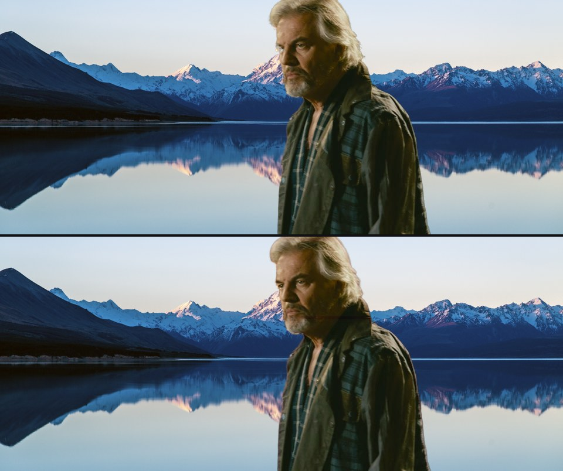
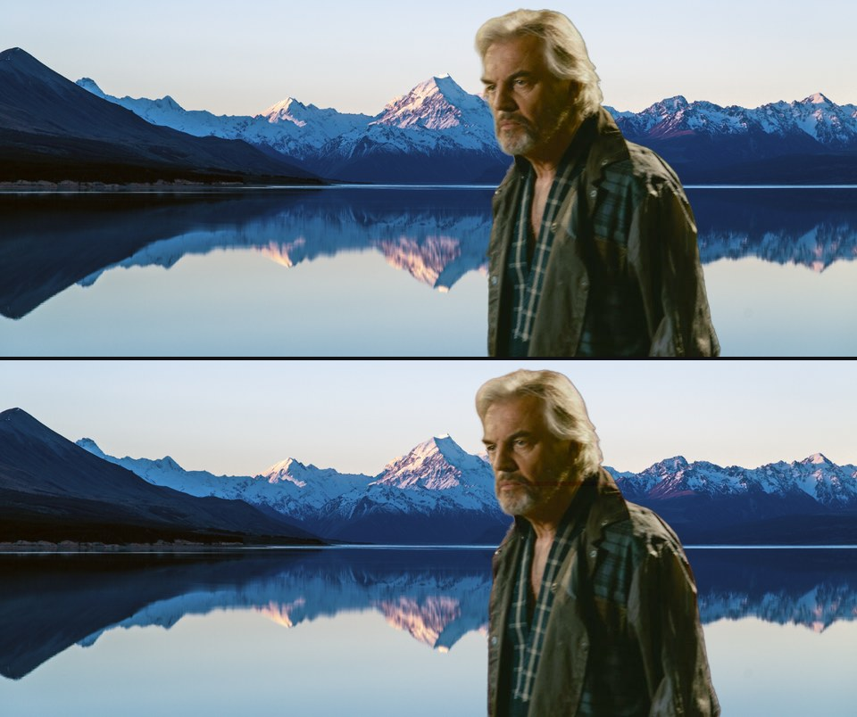
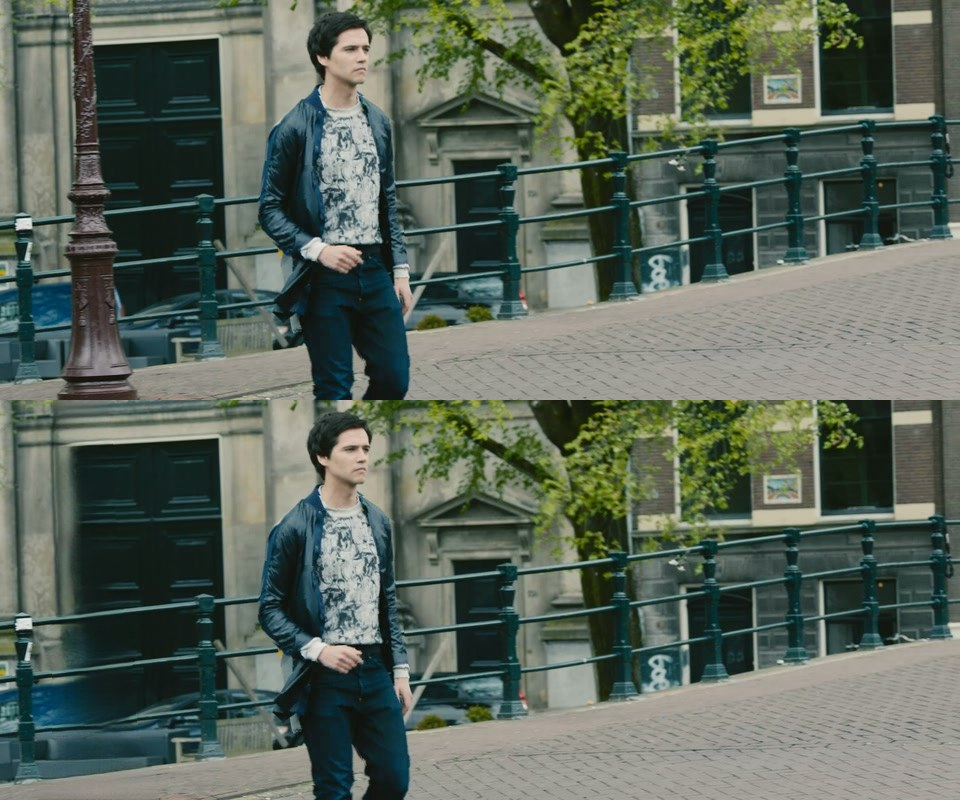
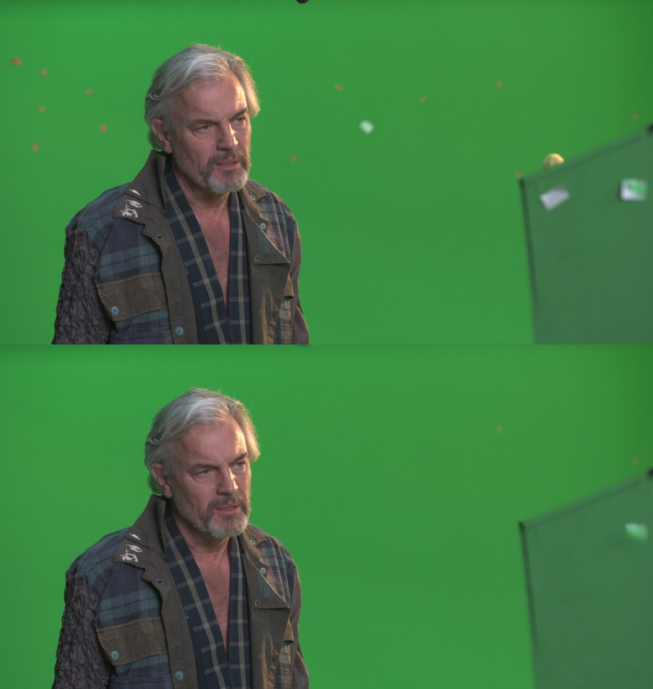
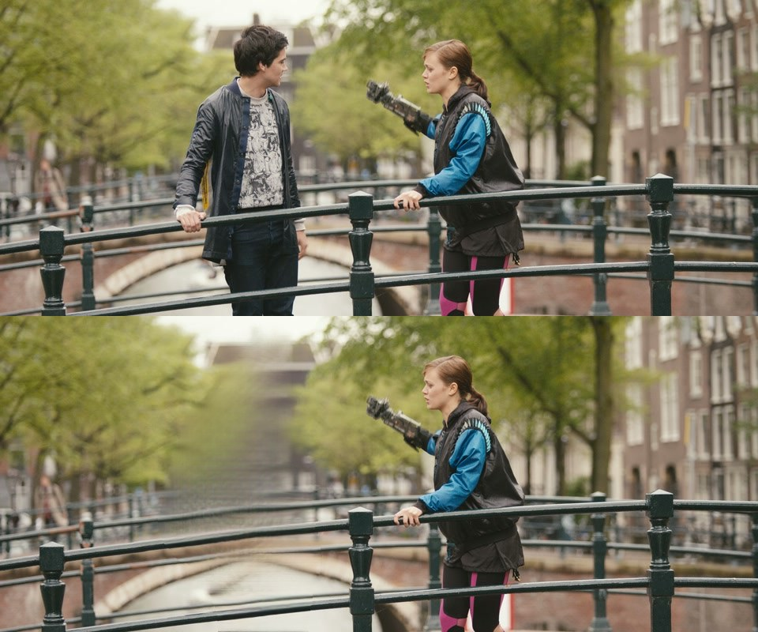

# Task 5 — the user's bug, then removal

Two halves. First, the two things the first real user test surfaced: degraded hair on
the backlit side, and stretches where part of the face drops out. Then the feature the
project is named after — click a thing, it vanishes, the background fills in.

Everything below is measured on this machine (Apple M3 Pro, 18 GB, MPS). Nothing is
cached, estimated, or reconstructed from an earlier run.

---

## Part 1 — the two bugs

### The hair was not what it looked like

Scored against the Tier B reference on `B1_tos_greenscreen_hair`, hair region only:

| Metric | their run (1 click, MatAnyone v1) | 1 click + HQ | well-formed clicks + HQ |
|---|---|---|---|
| MAD (x1e3, lower better) | 12.41 | 11.10 | **10.96** |
| MSE (x1e3, lower better) | 5.614 | 5.242 | **5.123** |
| Grad (x1e3, lower better) | 0.2913 | 0.2749 | **0.2694** |
| dtSSD (x1e2, lower better) | 5.673 | 5.506 | **5.46** |
| Boundary F (0–1, higher better) | 0.8825 | 0.9008 | **0.9048** |

HQ — MatAnyone 2 plus the hair crop-and-zoom from Task 4 — recovers about **12%** of the
hair MAD for 0.07 s/frame, and it is now on by default in the app. Better clicks add
almost nothing on top of that (10.96 against 11.10), and on the **whole frame** they
actively hurt: MAD 2.691 against 2.389, boundary-F 0.972 against 0.9883. Prompting
harder is not the fix here, and telling a user to click more would have been wrong
advice.

### The face dropout is a real SAM 2 limitation

Localised to frames **73–87**, x 412–567, y 53–295 — the shadowed jaw as the actor turns
away from the practical lamp. The pixels are missing from the SAM 2 binary mask *before*
MatAnyone runs, so this is segmentation, not matting.

| Attempt | SAM 2 stage, mean excluded skin px | Final | Frames > 150 px |
|---|---|---|---|
| Their run (1 click, MatAnyone v1) | 52.9 | 69.6 | 26 / 96 |
| Well-formed clicks + HQ | 52.4 | 61.4 | 18 / 96 |
| Plus a corrective click on the beard at f73 | **54.2 (worse)** | 61.5 | 18 / 96 |

A corrective click aimed straight at the dropout made segmentation **worse**. That is
the third instance of the same pattern — SAM 2's conditioning frames are global, so a
click added to fix one frame silently redefines the object everywhere. The recoverable
12% comes from the matting stage, not the prompt layer.

Full write-ups: [USERBUG_HAIR.md](USERBUG_HAIR.md) and
[KNOWN_ISSUES.md](KNOWN_ISSUES.md).

---

## Part 2 — removal

Matte → dilate into a hole → ProPainter fills it. Scored on four synthetic clips where
the clean background is the correct answer by construction.

| | R1 mars | R2 city | R3 canal | R4 harbour |
|---|---|---|---|---|
| PSNR in hole (dB) | **22.19** | 21.59 | 15.96 | 18.36 |
| SSIM in hole | 0.502 | **0.635** | 0.440 | 0.602 |
| Warp error in hole (x1e3) | 0.126 | 0.107 | 2.063 | 0.889 |
| — same metric on true background | 0 | 0 | 6.681 | 2.825 |
| Hole area | 11.0% | 9.9% | 11.1% | 19.7% |
| Background | static | static | moving | moving, big hole |

The headline is in the last two rows. On **static** backgrounds the floor is zero, so the
0.11–0.13 the fill scores is pure spurious flicker. On **moving** backgrounds the fill
reproduces **31% of the true motion in both cases** — it under-moves, by nearly the same
factor each time. R3 is the worst clip by PSNR *and* sits below the temporal floor: a
stability metric on its own would have graded it a success. A fill that scores well on
temporal stability and badly on PSNR is smoothing, not tracking.

### Three real removals

| Demo | Frames | Hole | s/frame | lowest available RAM |
|---|---|---|---|---|
| A — cast-iron lamppost, walk shot | 24 | 6.04% | 2.17 | 1408 MB |
| B — tracking markers, 08_3a green plate | 48 | 2.03% | 6.30 | 502 MB |
| C — one actor of two, dialogue shot | 96 | 14.44% | 2.20 | 1069 MB |

Demo B's mask comes from a **detector, not a click**: markers are the small non-green
blobs left once the subject is excluded via the Tier B keyed alpha. The largest one is so
far out of focus that green bleeds through it and it passes a greenness test, so it is
caught on saturation instead — 0.287 below the local backing against 0.182 for clean
backing at p99.9, which is what sets the 0.20 threshold. Fifteen blobs a frame, all gone,
actor untouched; one small mark survives, so recall is not perfect.

Detail, prose and the full failure list: [REMOVAL_BENCH.md](REMOVAL_BENCH.md).

### What the demos taught that the metrics did not

**A camera move helps removal.** This is the opposite of the intuition and it is the
strongest single predictor in the set. Panning past the lamppost is parallax, and
parallax genuinely reveals the background, so demo A's fill is recovery. The actor in
demo C barely moves relative to camera for 96 frames, nothing ever reveals the building
behind his head, and the result is a visible vertical smudge. Same code, same settings.

### Honest note on the memory guard

Demo B tripped the guard **twice** — once at 465 MB reclaimable, once on 6,034 MB of
swap growth — and I stopped and presented options rather than tuning around it. It
completed only after the machine was freed, at 48 frames instead of 96, and even then
with **502 MB of headroom against a 500 MB limit**. The thresholds were not relaxed to
make it pass. Removal is roughly 10× the per-frame cost of matting and it is the stage
that will stop a bigger job on 18 GB.

---

## Ranked gaps for Task 6

1. **A matting stage that can add coverage, not just refine.** The face dropout is
   unfixable at the prompt layer and the fix has to come from somewhere else. The trimap
   route with a wide unknown band scored best on boundary-F in Task 4 and is the obvious
   candidate. This is the only gap that a real user has actually hit.
2. **Real reference mattes instead of homemade ones.**
   `media.xiph.org/tearsofsteel/tearsofsteel-cleaned-exr/` is *not* marker cleanup as its
   name suggests — it is Blender's own **key**, and the EXRs carry a real fourth channel
   (verified: `(1012, 1920, 4)` against `(…, 3)` for the raw footage). That is a free
   professional matte for 76 shots under CC BY 3.0, and it is exactly what Tier B is a
   stand-in for. Numbering does not overlap by default — footage is `08_3a_00000–00846`,
   cleaned is `08_3a_0150–0359` — so pairing needs footage frames 150 and up. Every hair
   conclusion drawn from the in-house keyer should be re-checked against it.
3. **Motion-aware inpainting.** The 31% under-movement is systematic and measurable,
   which makes it tractable. Warping the fill along the completed flow, or conditioning
   on it more strongly, is the direction.
4. **Prompt robustness.** Three separate incidents now — near-coincident clicks, global
   conditioning frames, resolution sensitivity — all with the same shape: a small change
   to the prompt produces a large, non-obvious change to the mask. The app warns about
   one of the three. It should defend against all of them.
5. **Removal beyond one shot's length.** Nothing is scored past 96 frames, and the
   failure modes compound with duration.
6. **Memory headroom.** Full-resolution work is off the table on 18 GB and the guard now
   proves it rather than assuming it. Either buy resolution selectively, as the hair zoom
   does, or accept the Colab escape hatch for the removal stage specifically.
