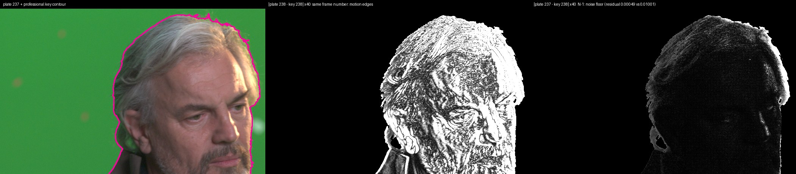
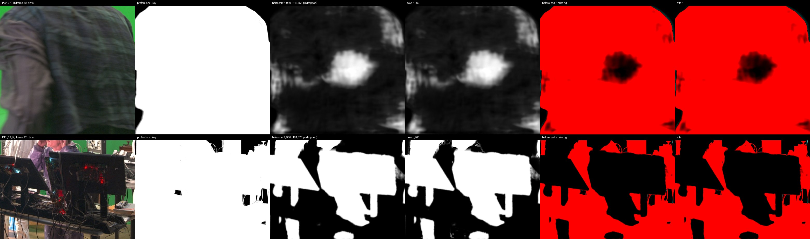
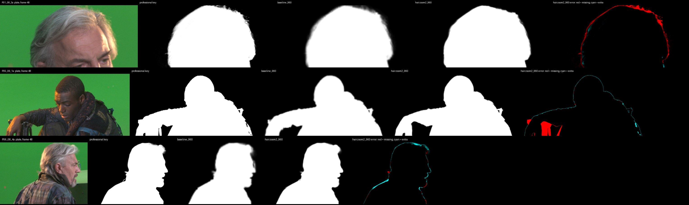

# Task 6 — RotoBench gets real truth

Task 4 built reference alpha with a chroma keyer I wrote, measured the hair problem
against it, and drew conclusions. Task 6 replaces that reference with the *Tears of
Steel* compositing team's own keys and re-checks every one of those conclusions.

Everything below was measured on this machine (Apple M3 Pro, 18 GB, MPS). The decision
rules for every verdict were committed to git before any result was read — commits
[`86df757`](https://github.com/shauryadata/cleanplate/commit/86df757) (the claims ledger)
and [`eca0092`](https://github.com/shauryadata/cleanplate/commit/eca0092) (the coverage
repair's integration rule). The oracle prompts were committed before that, in
[`a897332`](https://github.com/shauryadata/cleanplate/commit/a897332).

---

## Checkpoint 0 — the truth is off by one frame

`tearsofsteel-cleaned-exr` carries the compositor's key in a fourth channel. The plates
it was pulled from live in `tearsofsteel-footage-exr`. The two archives number frames
differently, and the obvious pairing is wrong:

**Key frame N was pulled from plate frame N−1.**

Found by a residual sweep rather than by eye. Where the key is fully opaque the
premultiplied foreground *is* the plate pixel, apart from despill and half-float
rounding, and sensor noise is independent frame to frame — so exactly one plate frame
matches closely and the rest cannot. Over the 36 test frames of the final set, the true
frame's residual is **4.3× to 477× below the runner-up** (median 11×), and the best
spatial shift is (0, 0) every time.

My own Task 5 memory note said to "match on frame number". It was wrong, and the cost
is not subtle. Scoring each key against itself shifted by one frame — exactly the error
that pairing would have introduced — injects:

| Clip | MAD | band MAD | dtSSD-n |
|---|---|---|---|
| P01 08_3a | 3.56 | 57.5 | 1.17 |
| P02 04_1b | 7.35 | 201.7 | 1.38 |
| P05 09_1a | 2.31 | 50.3 | 1.27 |

The best method on P01 scores MAD **2.01** and band MAD **32.8** in total. The
misalignment alone would have been larger than everything the benchmark set out to
measure, and it is invisible in a still frame.

Every clip now measures its own offset and records the evidence in its recipe. A clip
whose minimum is ambiguous, inconsistent across the window, or spatially shifted is
**refused, not built** — which is how 04_1a was caught (see checkpoint 1).

## Checkpoint 1 — what is actually in the archive, and what a subject is

**The archive is a mix.** "Cleaned" is not one thing, and the directory name tells you
nothing. Classified from pixels ([PRO_SURVEY.md](PRO_SURVEY.md), `scripts/survey_pro.py`):

| Class | Shots | What it is |
|---|---|---|
| character key | 35 | actor(s) over green, keyed out — usable as truth |
| set key | 24 | a room with a green window keyed out; every desk is "foreground" |
| no alpha / constant alpha / empty / unreadable | 17 | rig-removed plates and dead ends |

Only 21 of the 76 have a 1920-wide version at all; the rest are 4K only. My Task 5
claim that this was "a free professional matte for 76 shots" was generalised from one
shot, and is corrected here.

**Twelve clips**, chosen by stated rules: 6 core (96-frame windows), 3 stress (the key
also holds set dressing), 3 short (69–76 frames; the held-object and fast-motion axes
exist in the archive only at that length). Windows are the gap-free run nearest each
shot's centre in which no significant new object enters.

**Five shots were excluded, each on record with its reason.** Two of them are findings
in their own right:

- **07_1b and 07_1f hold the held prop *out* of the key.** The actor grips a cylinder
  covered in tracking-marker balls; the compositor cut it out, presumably for a CG
  replacement. A method that correctly mattes what the actor is holding would be
  penalised, so the shots are excluded rather than scored against a reference we
  disagree with. 07_1b's problem surfaced only because the **full-rate** lineage check
  refused the clip; the 8-frame selection pass had not seen it.
- **04_1a's key matches no plate frame.** A coarse search over every 10th plate frame of
  the shot, then a fine search, found only a shallow residual bowl — best 0.0142 at
  plate 77, within 5% of its neighbours and ~30× above a proven match. Its key was
  pulled from a plate that is not in the archive as-is (stabilised, reframed, or another
  take). Refused.

**The subject convention** ([SUBJECT_CONVENTION.md](SUBJECT_CONVENTION.md)) answers the
A2/A4 question from Task 4 in general form: the subject is the key's foreground,
including held objects and second people; specks the key also holds and that are not
attached to the subject go in an `ignore` mask; deliberate hold-outs disqualify a shot.

**The prompts are pre-registered.** Every method gets the same oracle prompt, derived
from the reference's frame 0 — a person gets head and body clicks; where one blob holds
several things, the parts are pinned by hand and named. They were committed before any
method ran on Tier P.

Two bugs were caught here, before anything was scored:

- **My first ignore rule discarded the hair.** It ignored every soft pixel more than
  5 px from the opaque core — which on P01 is the outer halo of backlit hair, exactly
  what this benchmark exists to measure. Now only discrete non-subject *objects* are
  ignored, with their own soft edges, and anything attached to the subject is kept
  (46,715 px/frame ignored → 422 px on 7 frames).
- **The Task 4 oracle could click the frame edge.** Its "most interior point" used a
  distance transform that does not treat the frame border as boundary, so on a torso cut
  off by the bottom of frame the peak lands on the edge. Fixed by padding.

## Checkpoint 2 — two metric gaps closed

Both gaps were on Task 4's own list of what to fix.

**dtSSD rewarded standing still.** A matte that never moves has zero temporal
derivative, so its dtSSD equals the reference's own motion — a small number on a slow
shot. `dtSSD-n` divides by that motion, so **a frozen matte scores exactly 1.0 on any
shot**, fast or slow, and a method with genuine temporal skill scores below 1.

The interesting part is where the gap actually lives. Within a single shot, dtSSD-n is
dtSSD over a constant and cannot reorder methods; my first version of the test asserted
a within-shot reversal and was mathematically impossible. The gap is in **aggregation**:
a slow shot's dtSSD is small whatever you do, so freezing on it costs almost nothing in
a cross-shot mean. Demonstrated in the validation suite: plain dtSSD ranks the method
that froze **first** (0.646 against 0.805), dtSSD-n ranks it **last** (0.516 against
0.230).

**The subject was contestable** — closed by the convention above, plus `ignore` masks
that neutralise non-subject pixels identically for every method.

Also added, and validated on cases with known answers: **band** metrics (every metric
restricted to the reference's transition band, which follows detail wherever it is,
unlike a head box), **coverage** metrics (misses at least 4 px inside the opaque core —
the user's face dropout expressed as a number), and **soft depth** (the Task 4 measure,
made a function so its claim could be re-tested).

`accuracy.score()` was rewritten to stream frame by frame: identical output on every
field to the previous whole-array version, 35% faster, and **1.6 GB peak instead of
4.7 GB** at 1920×1012×96 — which is what makes 84 scored runs possible on this machine.

The suite now has 16 sections, all passing (`python tests/test_accuracy.py`).

## Checkpoint 3 — re-verification: what held, what reversed

Seven methods on twelve clips, each clip × method in its own guarded worker. Standings
on the core clips (the full tables, including the stress and short groups, are in
[ROTOBENCH_RESULTS.md](ROTOBENCH_RESULTS.md)):

| Method | clips | mean rank | band MAD | hair MAD | MAD | BF | dtSSD-n | s/frame |
|---|---|---|---|---|---|---|---|---|
| hairzoom2 (MA2) | 5 | **1.20** | **151.4** | 15.10 | **18.23** | 0.835 | **0.681** | 0.49 |
| MatAnyone 2 | 6 | 2.33 | 151.8 | 17.26 | 27.65 | 0.832 | 0.703 | **0.22** |
| hairzoom (v1) | 5 | 3.60 | 200.7 | **14.47** | 41.19 | 0.755 | 0.758 | 0.50 |
| cover_960 (new) | 5 | 4.20 | 161.9 | 17.72 | 18.57 | **0.836** | 0.722 | 0.94 |
| trimap + ViTMatte | 6 | 5.17 | 198.8 | 21.45 | 48.51 | 0.761 | 0.774 | 0.36 |
| binary (SAM 2 only) | 6 | 5.50 | 194.6 | 24.44 | 44.86 | 0.727 | 1.083 | 1.27 |
| MatAnyone v1 | 6 | 5.50 | 197.0 | 20.88 | 48.45 | 0.758 | 0.770 | 0.22 |
| cover2_960 (new) | 5 | 7.00 | 196.4 | 26.28 | 23.29 | 0.784 | 0.861 | 0.99 |
| guided filter | 6 | 8.17 | 223.5 | 26.86 | 49.80 | 0.759 | 0.781 | 0.25 |

**Thirteen prior conclusions, each with a verdict fixed in advance: 8 hold, 3 reverse,
1 partial, 1 not re-testable.** The three the brief named:

- **The 2 px edge-depth claim HOLDS** — median 2.41 px across the core clips, inside the
  ≤ 3.0 px bar. It nearly did not: on P01 alone the professional key is **5.10 px** deep,
  and I reported that as a likely reversal before the other clips were in. The
  per-clip spread is **1.0 to 7.3 px**, so "the truth is about 2 px deep" is true as a
  median and close to meaningless as a description of any one shot. The measure itself
  was cross-checked: it reproduces Task 4's own numbers on Task 4's clips (B1 3.00 px,
  A3 2.24 px against 2.8 and 2.2 reported).
- **The hairzoom2 win is PARTIAL.** It still beats MatAnyone v1 on hair MAD by 30.7%
  (21.80 → 15.10) and it has the best mean rank overall, but it is **not** the lowest
  hair MAD of the seven: zoom with the *older* MatAnyone v1 is (14.47).
- **The B1 hair gains HOLD.** −15.8% on P01, inside the −6% to −18% bar, and −18.0%
  when the same predictions are scored against the in-house key.

The three reversals:

- **C4 REVERSES.** Task 4: "zoom with MatAnyone 2 beats zoom with v1 on 4 of 5 hair
  metrics". Against the professional key it wins **1 of 5**. The model upgrade helps
  the plain pass; it does not help the zoom pass.
- **C7 REVERSES.** Trimap + ViTMatte no longer has the best hair boundary-F.
- **C12 REVERSES**, and it is the one that matters most for this project: scoring the
  *same* predictions against the in-house key and against the professional key ranks
  the seven methods at Spearman **ρ = +0.75**, under the 0.80 bar. The keyer I wrote in
  Task 4 is not a reliable instrument for ranking methods — which is the whole reason
  this task existed. On identical frames it produces 0.60% soft pixels against the
  professional key's 1.42%, and edges 3.61 px deep against 5.10.

**P02 is a prompt failure, kept in the standings.** The oracle's "body" click is the most
interior point of the silhouette, which on this clip is the actor's *hand resting on his
chest*. With both clicks on skin, SAM 2 selected skin and hair and dropped the jacket for
all 96 frames; every method inherited it. The prompts were frozen before the run, so the
result stays. A post-hoc addendum, clearly labelled and kept out of the standings, adds
**one** click on the largest region the registered prompt missed:

| Method | whole MAD | band MAD | dropout frames |
|---|---|---|---|
| binary | 129.8 → **4.8** | 335.5 → 74.3 | 96 → 34 |
| MatAnyone 2 | 38.9 → **5.1** | 152.8 → 87.0 | 58 → 34 |
| hairzoom2 | 38.6 → **4.9** | 143.7 → 79.8 | 58 → 34 |

One click. That is the prompt-sensitivity defect from Task 4's gap list, now measured on
professional truth, and it dwarfs every difference between the methods.

**The run stopped itself twice on memory**, both times the zoom pass on P03, whose
"head box" is a near-full-width strip: 0.48 MP against the 0.25–0.28 MP that completed.
Per the brief I stopped and presented options; the chosen one was a size cap. Zoom
methods are recorded as "does not fit in 18 GB" on the five clips above 0.30 MP and
claims that compare them are judged only where every compared method ran. The methods
themselves were not modified, so Task 4's claims are tested on Task 4's method.

## Checkpoint 4 — the coverage bug, attacked with truth, and the attack fails

The repair: mark as *unknown* everything the mask may have dropped — pixels that were
subject within ±6 frames, plus holes enclosed by the mask — hand that trimap to ViTMatte,
and merge with `max()` inside the suspect region only, so it can add coverage and never
remove any. `cover2_960` is the blunt alternative: a wide unknown band everywhere.

Both fail the rule that was committed before they ran:

| Repair | recovered of base dropouts | dropout frames | core band MAD | integrate? |
|---|---|---|---|---|
| cover_960 | **0.4%** | 415 → 415 (0%) | **+7.0%** | no |
| cover2_960 | **1.9%** | 415 → 470 (worse) | **+29.8%** | no |

**Neither is integrated.** Both stay in the standings table as losers.

The breakdown says why, and it is more useful than the repair would have been.
Splitting base dropout pixels by whether the base *ever* had them within ±6 frames:

- **85.8% are regions the segmentation never selected at all** — P02's jacket, P11's
  tables, whole body parts. No matting stage can recover those: a trimap solver has no
  confident foreground to anchor to, so ViTMatte reads unknown-surrounded-by-background
  and answers background.
- **14.2% are intermittent** — the user's jaw class. Even there, the repair recovers
  1.9% (cover) and 4.4% (cover2).

The conclusion is a reversal of my own plan: **the coverage bug is not a matting problem
and cannot be fixed at the matting stage.** It is a segmentation problem, and the P02
addendum shows the size of the lever on the other side — one click took that clip from
MAD 129.8 to 4.8, where the best matting change in this entire task is worth 30% of a
hair-region metric.

## Checkpoint 5 — ROTOBENCH.md

[ROTOBENCH.md](ROTOBENCH.md) is the public document: what the benchmark is, the one table
showing why self-consistency is not accuracy, truth provenance and the alignment proof,
the subject convention, standings with cost, known limitations, how to reproduce it from
a clean clone, and how to submit a method. Every figure and table in it is regenerated
from Tier P by `scripts/rotobench_report.py` and `scripts/rotobench_figures.py`.

The self-consistency table is the one worth repeating here:

| Method | consecutive-frame IoU | rank by self | band MAD vs the key | rank by truth |
|---|---|---|---|---|
| MatAnyone 2 | 0.9707 | 1 | 156.3 | 2 |
| trimap + ViTMatte | 0.9701 | 2 | 210.2 | 6 |
| hairzoom2 (MA2) | 0.9679 | 6 | **151.4** | **1** |
| **frozen control** | **1.0000** | **1** | 434.6 | last |

Spearman between the two rankings: **−0.25**. A matte that never moves is perfectly
self-consistent and completely wrong; the best matte in the set ranks sixth of seven on
stability. Stability metrics cannot rank accuracy, and this is the table that shows it.

## Checkpoint 6 — what shipped

- **The app's HQ toggle keeps its default** (it still has the best mean rank and band
  MAD) but its label now carries the Tier P numbers, and says plainly that Task 4's
  −37.6% was measured against a reference keyed in-house.
- **A memory guard on the HQ pass.** The app now refuses the zoom when the head region
  would exceed 1.2 MP at 2× and says why, instead of thrashing. That threshold comes
  from the benchmark: completed at 1.0–1.1 MP, killed twice near 1.9.
- `guided()` and `fullres_matte()` were **restored** — commit f176d41 deleted them while
  refactoring and left the registry pointing at nothing, so `guided_960` had been
  unrunnable since Task 4. The restored version reproduces Task 4's stored B1 result
  exactly on all ten numbers.
- `scripts/download.sh pro` rebuilds Tier P from the committed recipes, re-proving every
  clip's alignment.

## Ranked gaps for Task 7

1. **Segmentation coverage is the whole ballgame, and prompting is the lever.** 85.8% of
   missing coverage is never-segmented region; one extra click on P02 moved MAD from
   129.8 to 4.8. Matting changes move hair metrics by tens of percent. The next real
   gain is an interactive loop that finds where the mask is wrong and asks for a click —
   or places one itself — not a better matting model.
2. **The reference still disagrees with our mattes about the outer hair.** The error maps
   are red along the top of the head on P01: the professional key keeps wisps our mattes
   drop. The 2 px claim holds as a median and hides a 1.0–7.3 px spread across shots.
3. **Our own keyer is not a ranking instrument** (ρ = 0.75). Tier A and Tier B results
   should be treated as indicative, not decisive, wherever they disagree with Tier P.
4. **The zoom pass does not scale.** It cannot run on five of twelve clips on this
   machine. Tiling it, or bounding the zoom by available memory, would make the best
   method usable on wide subjects.
5. **Twelve clips, one production, all green screen.** RotoBench needs a second source
   before its rankings mean much for location footage.
6. **Removal is unscored on professional truth.** Task 5's removal work was measured on
   synthetic composites; the Tier P plates and keys would support a real removal
   reference for the parts of frame the key says are background.
